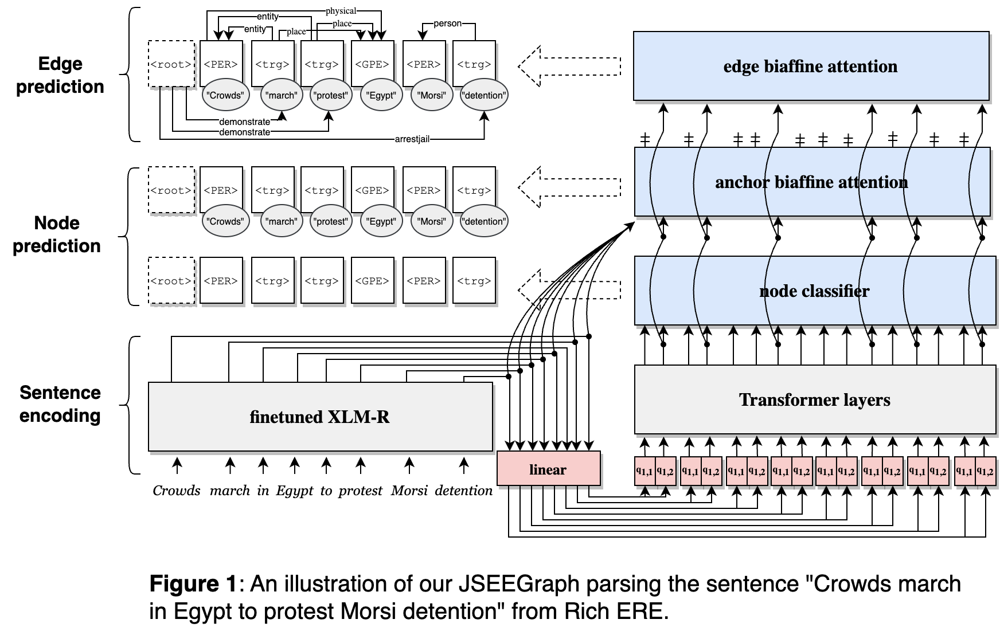
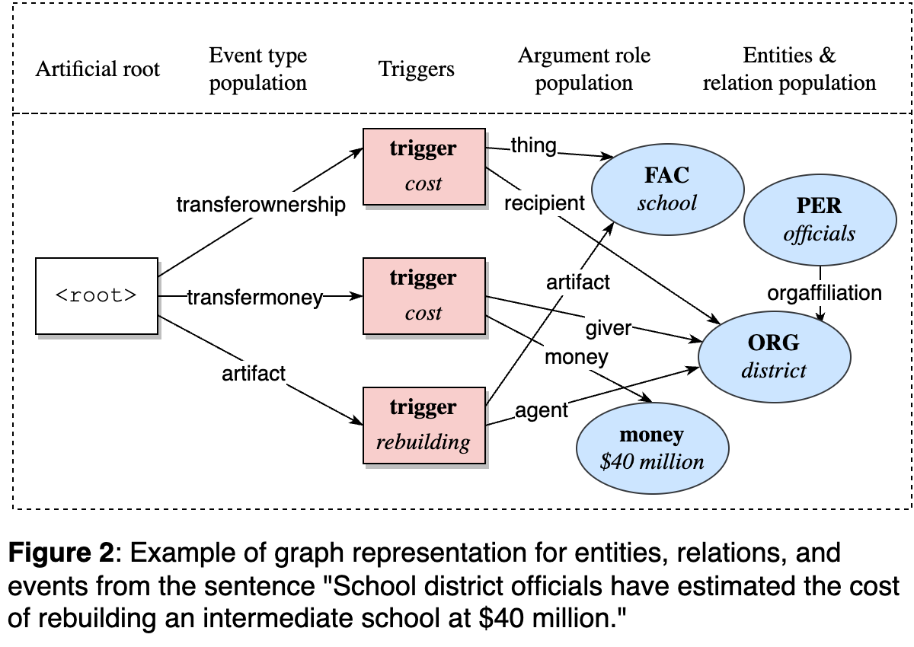

# JSEEGraph: Joint Structured Event Extraction as Graph Parsing

A graph-based framework for joint event extraction with entity and relation extraction.

General graph representation for entity, relation, and event.

## Data

Datasets used in this work can be obtained from Linguistic Data Consortium:
- ACE: [LDC2006T06](https://catalog.ldc.upenn.edu/LDC2006T06)
- ERE: [LDC2020T18](https://catalog.ldc.upenn.edu/LDC2020T18)